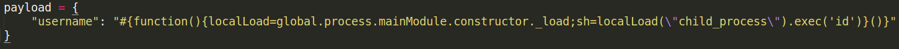
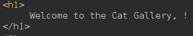
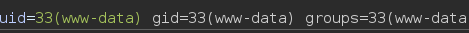
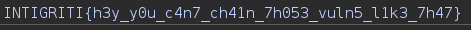

**Web - Cat Club**

Pour ce challenge, un fichier .zip contenant le code source du site est fourni.

Le site permet de se connecter et d'afficher une galerie de chats. On remarque que notre pseudo est reflété sur cette page, ce qui nous fait penser à une possible SSTI 

Cependant, l'enregistrement n'accepte que des noms d'utilisateur contenant des chiffres ou des lettres. En revanche, on voit que le site utilise des JWT. Avec le code source, on peut probablement en forger un...

On trouve un endpoint intéressant ici : 

 et 

Avec ces informations, on forge un JWT avec l'algorithme HS256 et choisit un username. Testons avec #{9*9} ! ! 
[test](Images/20241116214654.png)

Cela fonctionne ! 

Grâce au code source, on sait que le moteur de template utilisé est PugJS, alors on utilise un payload trouvé sur HackTricks, mais aucun retour sur la page web.

En testant l'exécution de la commande id : 

Le champ retourné est vide : 

On vérifie si la commande s'exécute côté serveur en utilisant curl pour envoyer une réponse externe. 

Et on obtient : 

Trouver le flag devient ensuite une formalité 

