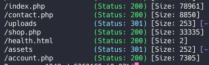
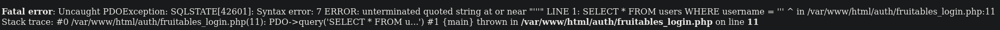
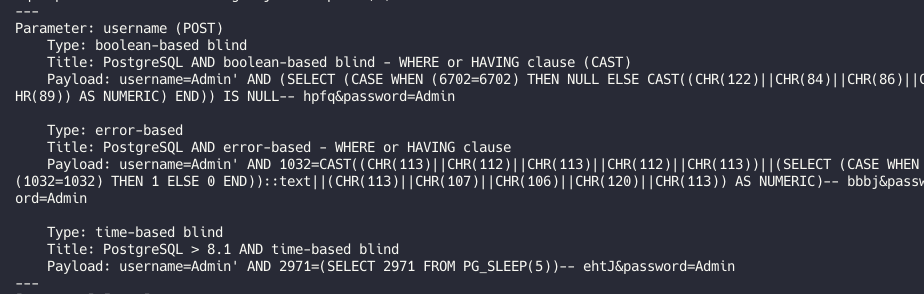
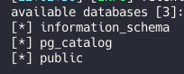
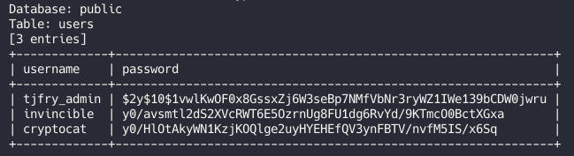
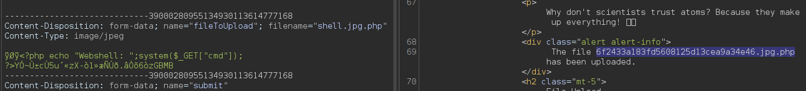
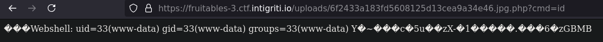
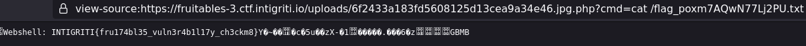

**Web - Fruitables**

Ici, aucun code source n’est fourni, donc j'ai dû tâtonner. Avec gobuster, j’ai trouvé un répertoire intéressant 

On remarque deux éléments : le répertoire /upload et /account.php, qui permet de se connecter. Mais sans identifiants, et avec l'inscription désactivée...

En testant une quote ' dans le champ utilisateur, on obtient une réponse intéressante 

Probablement une SQLi ? Après quelques tests manuels infructueux, je lance sqlmap 

Excellent ! 

 

Une fois le mot de passe administrateur cracké, j’accède au dashboard avec une fonctionnalité d’upload.

On teste d'upload un webshell, mais c'est bloqué. 

En analysant la requête dans Burp Suite, je change l'extension en .jpg, ajoute une signature JPEG au début du fichier, modifie le Content-Type... et ça passe ! 

 Il ne reste qu’à afficher le flag 

