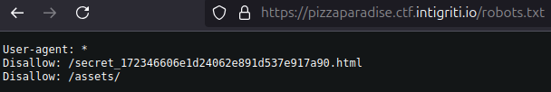
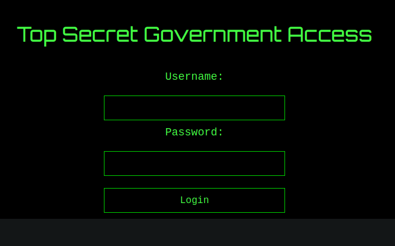
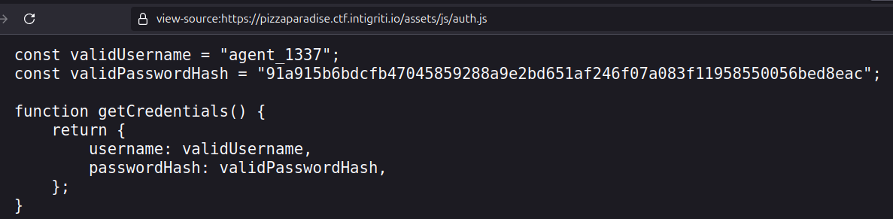
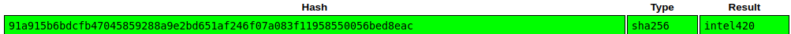
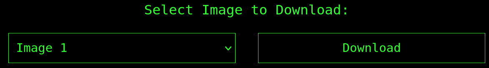
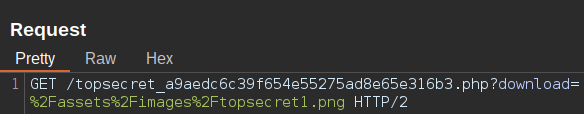
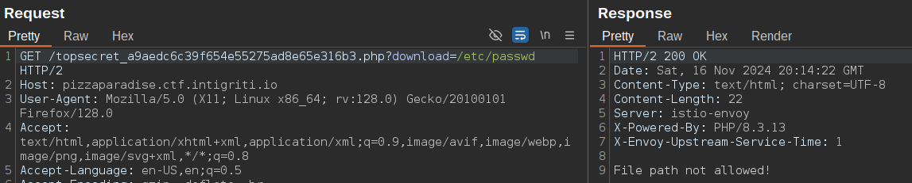
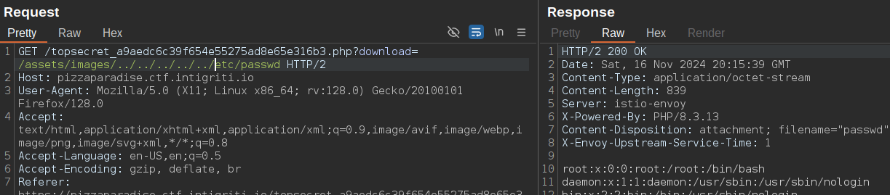
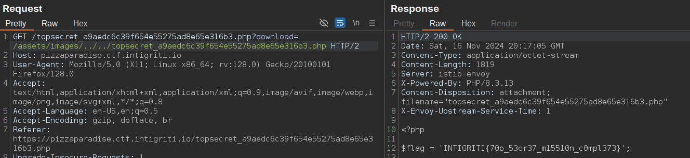

Web - Pizza Paradise

Pour commencer, on pense à regarder le /robots.txt 

On y trouve un répertoire secret qui nous mène à une page de login 

Dans le code source de la page, on voit un fichier auth.js contenant le nom d'utilisateur et son mot de passe sous forme de hash 

On crack le hash grâce au site Crackstation pour obtenir le mot de passe 

On se connecte avec ce mot de passe et on arrive sur une page qui permet de télécharger des images 

En interceptant la requête, on remarque que le chemin est potentiellement vulnérable aux LFI 

On commence les tests en mettant /etc/passwd 

Le chemin n'est pas autorisé, alors on tente en laissant le chemin de base /assets/images 

Cela fonctionne ! Pour le flag, on le trouve en affichant le code source de la page actuelle 

