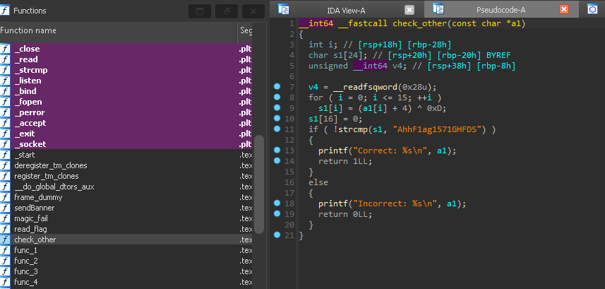
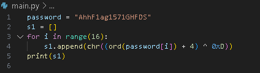

Write-up for the easy reverse challenge of the tryhackme ctf "Hackfinity"

If we look to all function, we see this one that look very interesting :

we have the string "AhhF1ag1571GHFDS" that is compare with our input, but our input is modify by the code before : a1[i] + 4 ^ 0xD

the invert of xor is xor so we do this simple script in python : 

that give us : HaaG8hf8468FAGEZ

We put it in the server and bingo we got the flag
